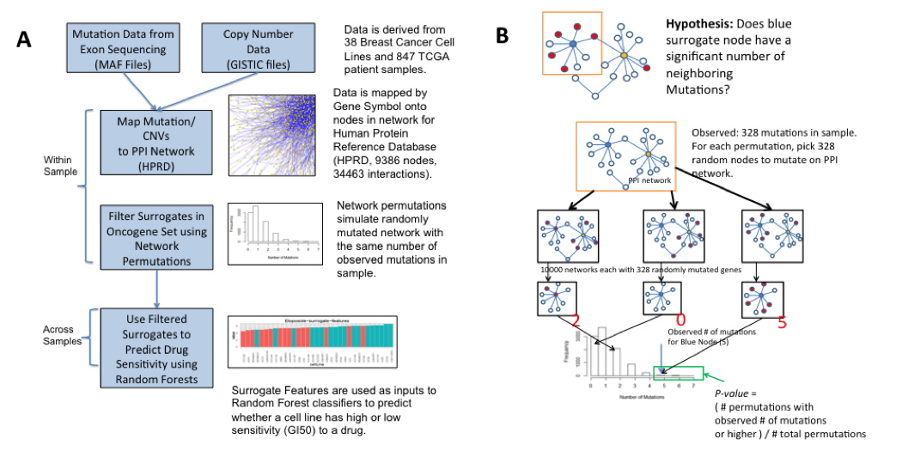
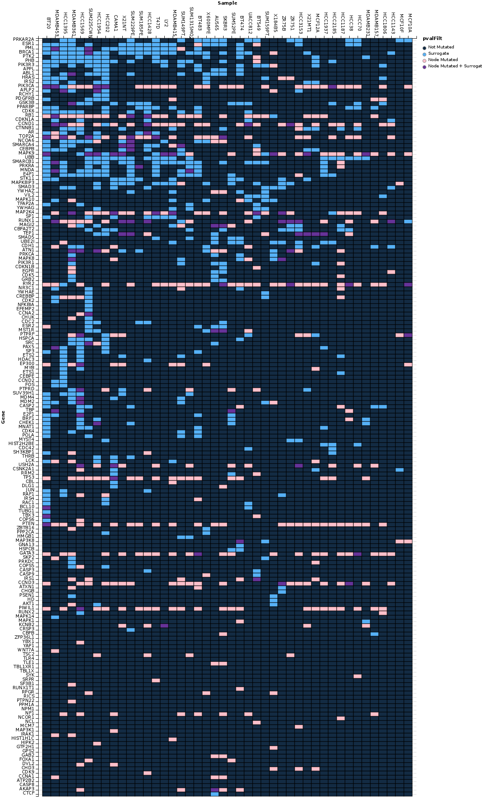

##Introduction

Tumorigenesis is a multi-step process, involving the acquisition of multiple oncogenic mutations that transform cells, resulting in systemic dysregulation that enables tumor proliferation. High throughput “omics” techniques allow rapid identification of these mutations with the goal of identifying treatments that target them. However, the multiplicity of oncogenes required for transformation (oncogenic collaboration) makes mapping treatments difficult. 

To make this problem tractable, we have defined oncogenic collaboration as mutations in genes that interact with an oncogene that may contribute to its dysregulation, a new genomic feature we term “surrogate mutations”. By mapping the mutations to a protein/protein interaction network, we can determine significance of the observed distribution using permutation-based methods. 

##Workflow and statistical framework



The above figure shows the general workflow and the statistical framework of the surrogateMutation package. GISTIC files are used to select genes in regions of high copy number variation and their copy number call in each sample. Mutations for each sample are derived from the Mutation Annotation Format (MAF) files. These genomic alterations are then superimposed onto a protein/protein interaction network. For a set of oncogenes of interest (the surrogate gene set), the surrogate analysis is then applied on a per-sample basis. 

A permutation-based framework was used to determine significance of a Surrogate Mutation (B). Within a sample and for each gene in the surrogate set, we ask the question whether the number of neighboring mutations is higher than an expected background. The background distribution for each surrogate gene is derived by randomly mutating the entire PPI network with the same number of mutations as observed in the sample. A p-value can be calculated from the proportion of permuted samples that have the observed number of neighboring mutations or higher.

##Installing the surrogateMutation package

Because some of the package dependencies are from Bioconductor, we suggest running the following install commands before you install the package from source.

```{r eval=FALSE}
install.packages(c("igraph", "Rgraphviz"))
source("http://www.bioconductor.org/biocLite.R")
biocLite(c("BioNet", "DLBCL"))
```

Additionally, if you want to run the multi-core version of the package, you will need to install the following packages:

```{r eval=FALSE}
install.packages(c("foreach", "doMC"))
```

##Preparing the Data Files for Input

The first step is to load in our protein/protein interaction (PPI) network. We first load in the surrogateMutation package. We are using a version of HPRD (Human Protein Reference Database) from the DLBCL package for our PPI network. The Node names from this package are in the format of Gene Symbol(EntrezID), so we first need to make a mapping table to map gene symbols to these node names in both the copy number data and the mutation data.  We do this with the buildGeneIntTable() function.

```{r results='hide', warning = FALSE }
library(surrogateMutation)
set.seed(333)
#load in HPRD network from the DLBCL package
library(DLBCL)
data(interactome)
intome <- interactome
geneIntTable <- buildGeneIntTable(intome)
```
Next, we will load the data from the TCGA Breast Cancer patients. We will directly load in the mutation (MAF) and copy number data (GISTIC calls) from the PanGEA archive from Memorial Sloan Kettering. We also need a couple files from the Broad GISTIC pipeline to filter the copy number set.

Essentially the MAF files have a single line for each called mutation in each patient sample. The GISTIC calls are a gene-level summary of the GISTIC call (2 or 1 = copy number gain, 0 = neutral, -2 or -1 = copy number loss).  Each row of the GISTIC file consists of a gene-level call for each of the patient samples in the data.

We also need to transform the patient identifiers for the GISTIC file and the MAF file so they all map to the patients in patientsComplete.

```{r cache=TRUE, tidy=TRUE}
#load surrogate package up
options(stringsAsFactors = FALSE)

#grab BRCA patients from pancan that have both Copy Number and Mutation Information
patientsComplete <- read.delim("http://cbio.mskcc.org/cancergenomics/pancan_tcga/case_lists/BRCA_cnamut_complete.txt")
patientsComplete <- patientsComplete[,1]
patientsComplete <- make.names(patientsComplete)

#read in BRCA mutations for all patients
BRCAmuts <- read.delim("http://cbio.mskcc.org/cancergenomics/pancan_tcga/maf/brca.maf")
#change barcode "-" to "." to match copy number data
BRCAmutsPatient <- make.names(BRCAmuts$Tumor_Sample_Barcode)
#truncate barcode to match patient data
BRCAmutsPatient <- substr(BRCAmutsPatient, 1, 12) 
BRCAmuts <- data.frame(BRCAmuts, Sample = BRCAmutsPatient)
#BRCAmuts$Sample <- as.character(BRCAmutsNodeMapped$Sample)
#length(unique(BRCAmutsPatient) ==)

#read in BRCA copy number for all patients
BRCAcns <- read.delim("http://cbio.mskcc.org/cancergenomics/pancan_tcga/cna/brca_CNA_data.txt")
#set rownames in CN data to be the gene symbols
rownames(BRCAcns) <- BRCAcns[,1]
#remove extraneous columns in CN/GISTIC data
BRCAcns <- BRCAcns[,-c(1:3)]
#make sure column names map to patientsComplete by subsetting sample names to tcga patients
colnames(BRCAcns) <- substr(colnames(BRCAcns), 1, 12)
#confirming this is true
length(colnames(BRCAcns) %in% patientsComplete)
```

We need additional information from the BROAD institute for the copy number events.  Specifically, we limit our copy number input to those high confidence calls that are available in the amp_genes and del_genes files from the GISTIC pipeline.  These files give the high confidence copy number calls sorted by genomic peak.  We can parse them using the readPeakFile() function.

```{r, cache=TRUE, tidy=TRUE}
#download additional GISTIC info from BROAD
download.file("http://gdac.broadinstitute.org/runs/analyses__2012_12_21/data/BRCA/20121221/gdac.broadinstitute.org_BRCA.CopyNumber_Gistic2.Level_4.2012122100.0.0.tar.gz",
              destfile = "brcaGistic.tar.gz")
#grab additional GISTIC info from BROAD - we need the amp_genes and del_genes files
untar(tarfile = "brcaGistic.tar.gz")
gisticDir <- "gdac.broadinstitute.org_BRCA-TP.CopyNumber_Gistic2.Level_4.2012122100.0.0/"
ampGenes <- readPeakFile(paste0(gisticDir,"amp_genes.conf_99.txt"))
delGenes <- readPeakFile(paste0(gisticDir, "del_genes.conf_99.txt"))
#cnaGenes is set of high confidence genes that are amplified and deleted across all samples 
cnaGenes <- c(ampGenes, delGenes)

#show cnaGenes
cnaGenes[1:10]
```

Now that we have the high confidence calls from GISTIC, we filter the GISTIC copy number file to these high confidence calls. Then we can filter both the copy number and the mutation data, limiting them to patients that have both copy number and mutation calls (i.e., those patients in the patientsComplete vector).

```{r}
#filter the data set to only those genes
focalBRCA <- BRCAcns[rownames(BRCAcns) %in% cnaGenes,]

##subset copy number data to only patients that have copy number and mutation data
inComplete <- intersect(colnames(focalBRCA), patientsComplete)
focalBRCA <- focalBRCA[,inComplete]

#filter mutation data to only patients with both copy number and patient data
BRCAmuts <- BRCAmuts[BRCAmuts$Sample %in% patientsComplete,]

```

Now we map the copy number and mutation data to nodes that exist in the HPRD network by using our geneIntTable data frame.

```{r}
#add gene.symbol column
focalBRCA <- data.frame(Gene.Symbol=rownames(focalBRCA),focalBRCA)
##map copy number data to genes in HPRD network
focalBRCAnodeMapped <- merge(focalBRCA, geneIntTable, by.x = "Gene.Symbol", by.y="Gene")

#map mutation data to network
BRCAmutsNodeMapped <- merge(BRCAmuts, geneIntTable, by.x = "Hugo_Symbol", by.y="Gene")

```

The other input we need to run the analysis is the surrogate mutation set themselves. This is a set of highly mutated oncogenes and their immediate neighbors. In our analysis we only include neighbors to the oncogene set that have at least two connections to this set.  We map this set to the node names using our geneIntTable.

```{r}
#load surrogate network genes (included for BRCA)
data("surrogateNodes")
surrogateNodes <- as.character(surrogateNodes[,1])
surrogateNodes <- unique(surrogateNodes)
```

##Running the Surrogate Analysis using the prepared files

After all of this preparation, we are ready to run the analysis. For the sake of execution time, we only run the analysis on the first three patients in the patientsComplete vector, and limit ourselves to 100 permutations for each patient. Normally, we would run the analysis using at least 10000 permutations and on the entire dataset.

By setting the cores option, we can run the permutation analysis on multiple processors using the foreach() package. Note that we limit the analysis by submiting smallPatient (the first three patients) vector as an argument to samples.

```{r results='hide', warning = FALSE, tidy=TRUE}
#example run: run results on three patients for 1000 permutations
smallPatient <- patientsComplete[1:3]
smallPatient
surrogateResult <- calcNeighborMutations(intome, nodeset=surrogateNodes, focalBRCAnodeMapped, 
                              BRCAmutsNodeMapped, Samples=smallPatient, 
                              cores=NULL, prefix="pancanBRCA-", numPermutes=100, geneIntTable=geneIntTable)
```

##Examining Surrogate Results within a single sample

Once the surrogate analysis is complete, we can look at the results. We will first look at results for a single patient. The results object has 3 slots: cellResults, which are the main surrogate results, mutCopyFrames, which gives information about the mutations and copy number alterations. Additionally, files will be generated for each of these structures with the prefix of above and with the sample name in the working directory.  Each of these slots consists of a list, where which each slot corresponds to results for a particular sample.

We first look at the cellResults object, which contains p-values and other information for each surrogate gene. cellResults is a list with each slot containing a data.frame.

```{r}
#examine significant surrogates for the first patient
patient <- patientsComplete[1]

sigTable <- surrogateResult$cellResults[[patient]]
sigTable[1:5,]
```

Looking at this table, we can see the information that is provided on a per patient basis.  The "isMutated" column reports whether the surrogate gene itself is mutated or not. The "degree" column gives the total number of connection that surrogate gene has. The "neighborVec" column contains the number of neighboring mutations observed for that surrogate gene. Note that in this count, we include the surrogate gene if it is mutated. The "pvalue" column gives the p-value given the permutation analysis. Note that the smallest p-value is limited by the number of mutations (i.e., for 10000 mutations, the smallest p-value available is 10000^-1 = 1e-4).

Given this table, we can filter our results based on the p-value.  If there is a desired number of mutated neighbors we can also filter on this criteria.

```{r}
#look at significant surrogate patients for a patient
filteredSig <- sigTable[sigTable$pvalue < 0.05 & sigTable$neighborVec > 2,]

filteredSig
```

Once we know the significant surrogate gene / sample pairs, we can plot the individual surrogate mutations using the renderSubNetSimple() function.

```{r tidy=TRUE}
#grab the first significant candidate
nodeSig <- as.character(filteredSig[1,"NodeName"])
geneSig <- geneIntTable[as.character(geneIntTable$NodeName) %in% nodeSig,"Gene"]
geneSig

#plot a significant network for the surrogates
renderSubNetSimple(NodeName=nodeSig, sampleName=patient, GeneName=geneSig, intome=intome, 
                         resultObj=surrogateResult,fileOut=NULL)
```

The renderSubNetSimple() function generates an SVG file with name format (Sample)-(Gene).svg. SVG files are scalable and better for publication quality figures.
 


##Examining Surrogate Results across Samples

We can also examine patterns across the three patients.  The buildSurrogateTable() function aggregates the results object we created and creates a 'melted' data frame (as per Hadley Wickham's reshape2 package). Each line of this data frame corresponds to a Sample/Gene pair.

Using the reshape package, we can convert this melted frame into a matrix of p-values.  This matrix of p-values can be filtered according to various criteria to produce interesting candidate surrogate mutations. For more information about the columns returned, please refer to the documentation for the buildSurrogateTable() function.

```{r}
#build a 'melted' version of the surrogate table for all samples
surrogateTable <- buildSurrogateTable(surrogateResult)
```

We can aggregate the data into matrix form using the dcast() command from reshape.  

Additionally, we can filter this table to only significant candidates. If we are only interested in those mutations that have 4 or more neighbors, we can filter on this crtieria as well.

```{r}
filteredSurrTable <- surrogateTable[surrogateTable$pvalue < 0.05 & surrogateTable$neighbor > 3,]
filteredSurrTable
```
We can also plot all of the significant surrogate candidates using plotAllGraphs. Be cautious about using this - it will produce a lot of graphic files depending on how large the surrogateTable you pass to it.

```{r eval =FALSE}
plotAllGraphs(surrogateTable = filteredSurrTable, surrogateResults = res1, intome = intome)
```

A Shiny app is available for exploring the surrogate mutations in the breast cancer cell lines here: https://tladeras.shinyapps.io/surrogateShiny/  This app presents the surrogate mutation results in the form of a interactive heatmap where columns are samples and rows are surrogate mutations. The surrogate genes can be filtered by p-value, sorted by clustering order in both the rows and the columns, by number of mutations observed in the samples, total number of connections for each surrogate.

